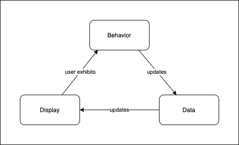

# Phase 1 Lecture 7 - CRUD with Fetch - POST requests

## Agenda

- Review Refactors of the Music Library Application
- The current version of the application relies on `fetch` to retrieve data from db.json rather than storing the songs within `playlist`.
- Build out Create by connecting the three pillars.
- Discuss data attributes and their use within event handlers to interact with key information.

## Three Pillars

- Recognize Events (Behavior)
  - DOMContentLoaded to populate the list of songs and load the first into the player
  - Clicking on a Song to load it into the player
  - Submitting the new song form
  - Submitting the new comment form
- Communicate with the Server (Data)
  - GET all songs
  - POST new song
  - GET all comments on a particular song.
  - POST new comment
- Manipulate the DOM (Display)
  - A function that takes song data as an input and uses it to add the song to the DOM along with its related comments
  - A function that takes persisted comment data as an input and uses it to add the comment to the DOM.
  - A function that takes an array of songs as an argument and renders each of them as an `li` element in the sidebar.
  - A function that takes an array of comments as an argument and renders them to the comments container below the player.

## Behavior

> - Event Listeners to watch for user behaviors we want to respond to (starting with DOMContentLoaded)
> - Event handlers that respond to those behaviors by updating our data and subsequently the DOM.

## Data

> - Variables we define to keep track of the state of our application.
> - Information we retrieve from our server relating to our application.

## Display
> - DOM nodes that serve as containers for displaying our data
> - Functions that take data as an input and update the DOM accordingly.

## Music Library API

### Behavior
- DOMContentLoaded
  - load all songs from database and into sidebar
  - load first song into player
- Click
  - Song => Load the appropriate song into the player
- Submit
  - NewSongForm => Add song to Database and then into sidebar

### Data
- Requests
  - `getSongs()` => fetches all songs from database. It returns a promise for an array of song objects.
  - `createSong(songData)` => takes in song data, stringifies it, and posts it to database. It returns a promise for a single song object.
- Utilities
  - `extractVideoId(url)` => takes a youtube video/embed/playlist url and extracts and returns the youtube Video ID. (to be used in the src for the iframe to allow the video embed)

### Display
- `renderSong(song)` takes a song object as an argument and creates an `li` element that will represent it in the DOM, appends it to the sidebar.
- `loadSongIntoPlayer(song)` takes a song object as an argument and loads its details into the player. (After today, this will also load its comments below the video)

### Today's Changes

#### Behavior
- Submit
  - New Comment Form => pull data out of form and pass it to `createComment` which will update the database and then the DOM using the `renderComment` method.
- Click
  - When a user clicks on a song within the sidebar (this event listener/handler already exists!) load the comments corresponding to that song from DB and then into the DOM.

#### Data
- `createComment(commentData)` => takes a commentData object (with comment and songId properties) as an argument, adds them to the database and passes the persisted comment to `renderComment`
- `getComments(song)` => fetches all comments from the database that have a songId matching the song's id. Pass the comments to `renderComments`
#### Display
- changes in `index.html`
  - add a container for comments with an id of `comments`.
  - Add a form to create a new comment with an id of `newComment`. The form should have:
    - a textarea input with an id of `commentInput`
    - a data attribute for the `songId` of the song that is currently loaded into the player.
- `renderComment(comment)` => takes a comment object as an argument, creates a DOM element to display it and appends it to the DOM.
- `renderComments(comments)` => takes an array of comment objects as an argument, clears out the DOM container for the comments and appends all of the comments passed each as an argument to `renderComment`.

## Tomorrow we'll focus on Adding PATCH and DELETE requests